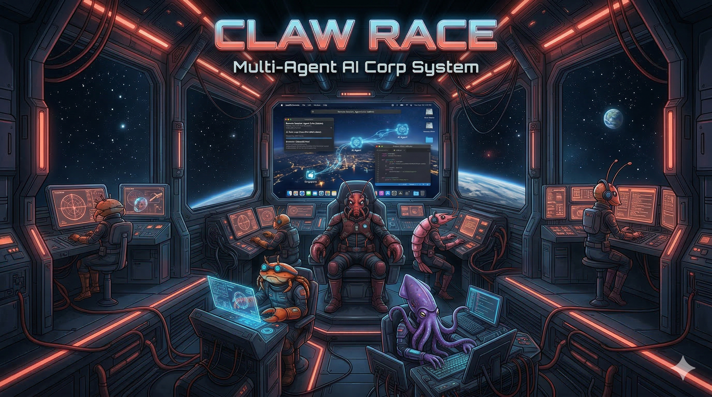
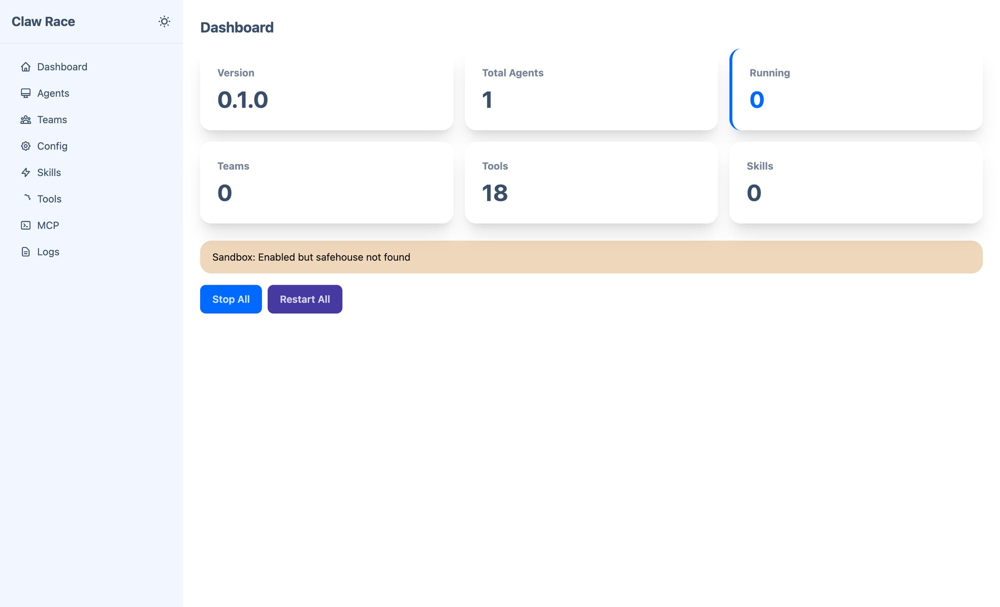
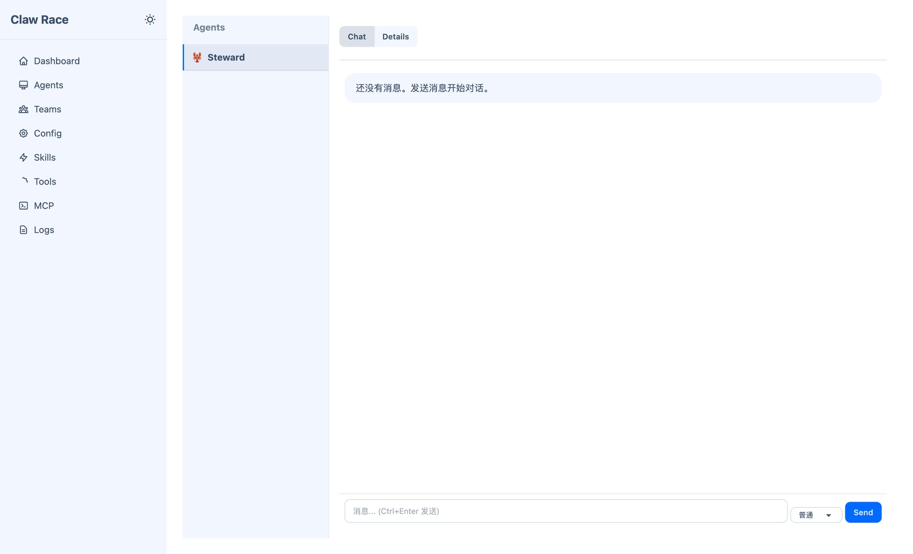

# 🦞 Claw Race (see-agent-corp)

A multi-agent desktop AI system where autonomous agents collaborate in teams to accomplish tasks. Built with Rust.



## Features

- 🤖 **Multi-Agent System** — Create and manage multiple AI agents, each with their own personality, memory, and skills
- 👥 **Team Collaboration** — Organize agents into teams with leaders and members, task boards with dependency tracking
- 🧠 **Persistent Memory** — Agents remember across sessions with BM25 search and structured memory files
- 🖥️ **Screen Awareness** — Agents can see your screen and operate your Mac via screenshot + mouse/keyboard tools
- 🛡️ **Sandbox Security** — Process-level isolation via [Agent Safehouse](https://github.com/eugene1g/agent-safehouse) on macOS
- 🔧 **Extensible Tools** — Grouped tool system (core/memory/team/screen), MCP server support
- 📦 **Skills Ecosystem** — Lazy-loaded skills with per-agent enable/disable, compatible with ClawHub
- 🌐 **Web UI** — Real-time chat, team management, task boards, config editor, all in one interface
- ⚡ **Smart Context** — Four-layer compression (tool truncation → microcompact → full compact → image decay)




## Quick Start

### Install

```bash
curl -fsSL https://raw.githubusercontent.com/Xiamu-ssr/see-agent/main/scripts/install.sh | bash
```

This installs the `see-agent-corp` binary to `~/.see-agent-corp/bin/`.

### Start

```bash
see-agent-corp start --port 28789
```

Open **http://localhost:28789** in your browser.

First launch automatically creates the workspace (`~/.see-agent-corp/`) and the system agent 🦞 Steward.

### Configure LLM

Go to **Config** in the web UI and set your LLM provider:

- `base_url`: Your OpenAI-compatible API endpoint
- `api_key`: Your API key
- `model`: Model name (e.g. `gpt-4o`, `claude-opus-4-6`)

Any OpenAI-compatible API works (OpenAI, Anthropic via proxy, local models, etc.)

## CLI Reference

```bash
see-agent-corp start [--port 28789]              # Start server
see-agent-corp stop                               # Stop server
see-agent-corp restart                            # Restart server
see-agent-corp status                             # System status

see-agent-corp agent create -i <id> -n "Name" -e "🦀"   # Create agent
see-agent-corp agent list                                  # List agents
see-agent-corp agent show <id>                             # Show details
see-agent-corp agent delete <id>                           # Delete agent
see-agent-corp agent team <id> <team_id|none>              # Change team

see-agent-corp team create "Name" -l <leader> -m "id:role" # Create team
see-agent-corp team list                                     # List teams
see-agent-corp team delete <id>                              # Delete team
see-agent-corp team leader <id> <agent_id>                   # Change leader
```

## Architecture

```
~/.see-agent-corp/
├── config.json              # Global config (LLM, tools, skills, sandbox)
├── agents/
│   ├── system/              # 🦞 Steward (built-in system agent)
│   │   ├── agent.json       # Agent config (overrides global)
│   │   ├── IDENTITY.md      # Name, emoji, race
│   │   ├── SOUL.md          # Personality
│   │   ├── inbox.jsonl      # Message inbox
│   │   ├── memory/          # Persistent memory
│   │   ├── session/         # Conversation history
│   │   └── skills/          # Agent-specific skills
│   └── <agent-id>/          # User-created agents
├── teams/
│   └── <team-id>/
│       ├── team.json        # Members, leader, roles
│       ├── tasklist.json    # Task board with dependencies
│       └── shared/          # Shared workspace
└── skills/                  # Global skills directory
```

## How It Works

1. **Message Flow**: User sends message → inbox → Worker process drains → LLM reasoning loop → tool execution → response
2. **Dual Cursor**: Collect messages batch at turn boundaries; Steer messages inject before next LLM call
3. **Team Coordination**: Leader creates/assigns tasks → members claim → execute → report back
4. **Context Compression**: Tool output truncation (30K chars) → Microcompact at 30% → Full compact at 95% → Image decay (3 high + 3 low + omit)
5. **Hot Reload**: Config changes detected by file mtime, brain/prompt rebuilt automatically

## Tech Stack

- **Backend**: Rust + Axum + Tokio
- **Frontend**: Leptos (Rust → WASM) + DaisyUI + Tailwind
- **LLM**: OpenAI-compatible API (chat completions + tool calling)
- **Sandbox**: Agent Safehouse (macOS sandbox-exec)

## Build from Source

```bash
# Prerequisites: Rust, Trunk, wasm32 target
rustup target add wasm32-unknown-unknown
cargo install trunk

# Build frontend
cd see-agent-corp-web && trunk build --release && cd ..

# Build backend (embeds frontend WASM)
cargo build --release

# Run
./target/release/see-agent-corp start --port 28789
```

## License

MIT
